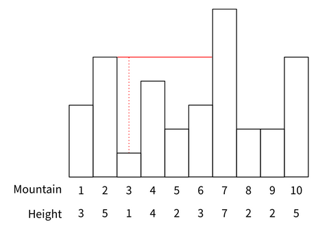

# Squashing Mega Doombas

## Original Problem
https://open.kattis.com/problems/bungeebuilder

## Description
A huge doomba is causing havoc in Gnocchi's village. Help Mario find a way to squash it!

## Problem Statement
There is a doomba that is terrorizing Gnocchi's village walking back and forth repeatedly between a range of N mountains of height H1, H2, ... , Hn. But it isn't a regular doomba... It is a MEGA DOOMBA!!!

Mega doombas are more resistant and can't be squashed as easily as regular ones. Lario was called to squash the mega doomba and for that he devised a plan. Lario is well-known for his plumbing experience but turns out he his also a decent builder. The plan involves constructing a wooden bridge connecting two distinct mountains, from which Lario will jump off to squash the doomba when he's strolling below it. Lario can build a wooden bridge at any height up to the minimum of the two connecting mountains as long as it is strictly higher than all mountains between the two.
The falling distance is limited by the vertical distance of the bridge from the ground directly below it. In order to ensure that the mega doomba is properly squashed, Lario should build the bridge to maximise the distance of the furthest point from the ground.

Consider the following example:

The optimal bridge is denoted by the solid red line and the jumping distance is denoted by the dotted red line.

Your task is to determine the maximum jumping distance achievable. If no bridge can be built, the distance returned should be zero.

## Input
The first line contains an integer N(1 <= N <= 106), the number of mountains. The second line contains N integers H1, H2, ..., Hn where Hi denotes the height of the ith mountain

## Constraints
- 1 ≤ N ≤ 106
- 0 ≤ Hi ≤ 109

## Output
A line with the maximum jumping distance possible